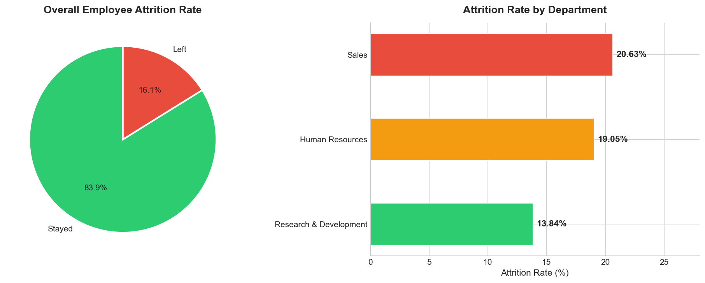
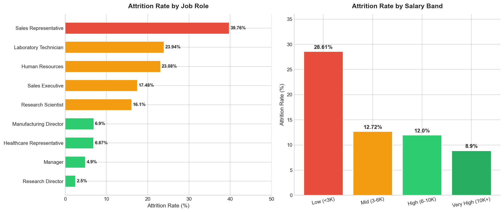
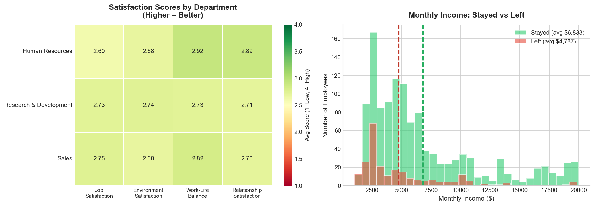
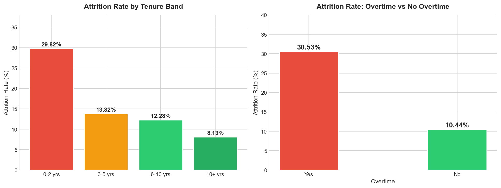
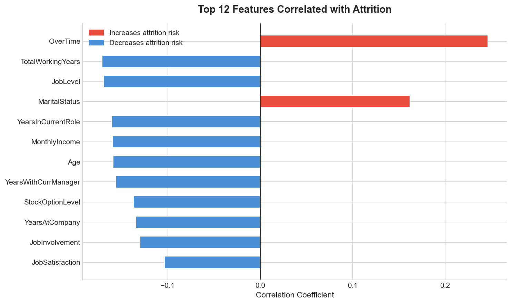
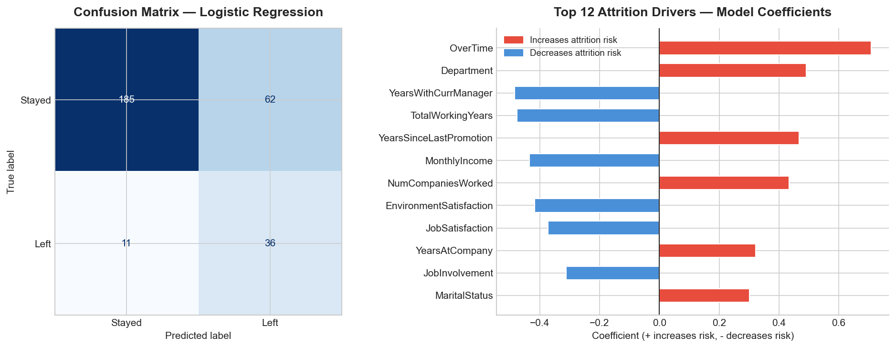

# HR Analytics — Employee Attrition Analysis
### Who is leaving, why, and which active employees are at risk next?

---
## Live Dashboard

[View Interactive Tableau Dashboard](https://public.tableau.com/app/profile/parshwa.gandhi/viz/HRAnalyticsEmployeeAttritionAnalysis/Dashboard1)
[HR Analytics: Employee Attrition Analysis — Tableau Public](https://public.tableau.com/app/profile/parshwa.gandhi/viz/HRAnalyticsEmployeeAttritionAnalysis/Dashboard1)

---

## Business Problem

A company is experiencing employee attrition and needs to understand what is
driving it. HR leadership wants to know which departments and roles are most
affected, what factors predict whether an employee will leave, and most
importantly which currently active employees are most likely to resign next.

The goal is to make a data-driven case for targeted retention interventions
before at-risk employees decide to leave.

---

## Dataset

| Property | Value |
|----------|-------|
| Source | Kaggle — IBM HR Analytics Employee Attrition |
| Rows | 1,470 employees |
| Features | 35 columns |
| Target | Attrition (Yes / No) |
| Overall Attrition Rate | 16.12% (237 employees left) |
| Missing Values | None |

---

## Project Structure

```
HR-Analytics-Employee-Attrition/
├── Data/
│   ├── hr_attrition.csv               # Raw IBM HR dataset
│   └── hr_attrition_tableau.csv       # Cleaned export for Tableau
├── Notebooks/
│   └── hr_attrition_analysis.ipynb    # Full analysis notebook
├── SQL/
│   └── hr_attrition_queries.sql       # 6 business SQL queries
├── Visuals/
│   ├── 01_attrition_overview.png
│   ├── 02_role_and_salary.png
│   ├── 03_satisfaction_and_income.png
│   ├── 04_tenure_and_overtime.png
│   ├── 05_feature_correlation.png
│   └── 06_model_performance.png
└── README.md
```

---

## Methodology

### 1. Data Cleaning
- Created binary attrition column (`Attrition_Binary`: 1 = left, 0 = stayed)
- Dropped zero-variance columns: `EmployeeCount`, `Over18`, `StandardHours`
- Engineered `SalaryBand` and `TenureBand` features for segmentation analysis

### 2. SQL Analysis
- Loaded cleaned dataset into SQLite
- Wrote 6 business queries covering department, job role, salary band,
  satisfaction scores, tenure, and overtime vs attrition

### 3. Exploratory Data Analysis
- Visualized attrition rates across all key dimensions
- Identified the strongest visual signals before modeling
- Built 5 charts covering the complete attrition story

### 4. Logistic Regression Model
- Encoded all categorical features with LabelEncoder
- Scaled features with StandardScaler
- Used `class_weight='balanced'` to handle class imbalance
- 80/20 train/test split, stratified by target
- Evaluated with accuracy, precision, recall, and confusion matrix

### 5. At-Risk Employee Ranking
- Scored all 1,233 currently active employees by predicted attrition probability
- Ranked employees from highest to lowest risk
- Segmented into High Risk (>70%), Medium Risk (40–70%), and Low Risk (<40%) tiers

---

## SQL Analysis Results

| Query | Key Finding |
|-------|-------------|
| Attrition by Department | Sales: **20.63%** — highest. R&D: 13.84%. HR: 19.05% |
| Attrition by Job Role | Sales Representative: **39.76%** — highest. Lab Technician: 23.94%. Manager: 4.90% |
| Attrition by Salary Band | Low (<$3K): **28.61%** vs Very High (10K+): **8.90%** — 3.2x difference |
| Satisfaction Scores | Employees who left scored lower on ALL 4 satisfaction metrics |
| Attrition by Tenure | 0–2 year employees: **29.82%** — drops to 8.13% at 10+ years |
| Overtime vs Attrition | Overtime workers: **30.53%** vs non-overtime: **10.44%** — 3x higher |

---

## Key Results

| Metric | Value |
|--------|-------|
| Overall attrition rate | **16.12%** (237 of 1,470 employees) |
| Highest-risk department | Sales — **20.63%** |
| Highest-risk job role | Sales Representative — **39.76%** |
| Highest-risk tenure band | 0–2 years — **29.82%** |
| Overtime attrition rate | **30.53%** vs 10.44% non-overtime |
| Income gap (left vs stayed) | $4,787 vs $6,833 avg monthly income |
| Model accuracy | **75.17%** |
| Model recall (left class) | **77%** |
| Top attrition driver | OverTime (coefficient: +0.70) |
| Highest at-risk employee | Healthcare Representative — **94.5%** predicted probability |

---

## Visualizations

### Attrition Overview & By Department


### Attrition by Job Role & Salary Band


### Satisfaction Heatmap & Income Distribution


### Attrition by Tenure & Overtime Impact


### Top Features Correlated with Attrition


### Model Performance & Coefficients


---

## Tableau Dashboard

👉 [HR Analytics: Employee Attrition Analysis — Tableau Public](https://public.tableau.com/app/profile/parshwa.gandhi/viz/HRAnalyticsEmployeeAttritionAnalysis/Dashboard1)

The interactive dashboard includes:
- 4 KPI cards (Total Employees, Attrition Count, Attrition Rate, Avg Monthly Income)
- Attrition breakdown by Department, Job Role, Salary Band, and Tenure Band
- Overtime impact chart
- Department and Overtime interactive filters

---

## Business Recommendations

### Recommendation 1 — Eliminate Mandatory Overtime for Sales Representatives
Sales Representatives have a 39.76% attrition rate nearly 2.5x the company
average. OverTime is the single strongest predictor of attrition in the model
(coefficient: +0.70).

**Action:** Cap overtime for Sales Reps at 5 hours/week and hire 10% additional
headcount to distribute workload. Retaining even 10 of the 33 who leave annually
saves approximately **$330K** in replacement costs (est. $33K per hire).

### Recommendation 2 — Build a Structured 90-Day Onboarding Program
Employees with 0–2 years tenure churn at 29.82% nearly double the company
average. The first two years are the highest-risk window.

**Action:** Assign every new hire a senior mentor for the first 90 days, conduct
30/60/90-day check-ins, and tie manager bonuses to new hire retention at the
12-month mark.

### Recommendation 3 — Raise Base Salary for Low-Band Employees
Employees earning below $3K/month churn at 28.61% vs 8.90% for top earners
a 3.2x gap. MonthlyIncome is a top negative coefficient in the model (higher
income = lower attrition risk).

**Action:** Conduct a compensation benchmarking study and target a 15% salary
increase for bottom-quartile earners. Reducing attrition in this band by just
20 employees saves **$660K** annually.

---

## Tools Used

| Tool | Purpose |
|------|---------|
| Python / pandas | Data loading, cleaning, transformation |
| SQLite / sqlite3 | SQL analysis layer — 6 business queries |
| matplotlib / seaborn | All 6 Python visualizations |
| scikit-learn | Logistic regression, scaling, evaluation |
| Tableau Public | Interactive dashboard |
| Jupyter Notebook | Analysis environment |

---

*Analysis by Parshwa Gandhi | MS Computer Science*
